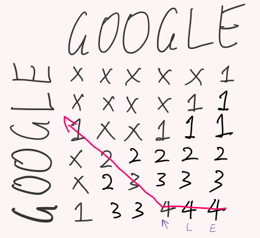

# Daily Coding Problem: Problem #34 [Medium]

Good morning! Here's your coding interview problem for today.

This problem was asked by Quora.

Given a string, find the palindrome that can be made by inserting the fewest number of characters as possible anywhere in the word. If there is more than one palindrome of minimum length that can be made, return the lexicographically earliest one (the first one alphabetically).

For example, given the string "race", you should return "ecarace", since we can add three letters to it (which is the smallest amount to make a palindrome). There are seven other palindromes that can be made from "race" by adding three letters, but "ecarace" comes first alphabetically.

As another example, given the string "google", you should return "elgoogle".

## My solution

I have an idea. It uses a 2d-array (matrix) to count how many character can I reuse. It's similar to the longest common subsequence matrix.

Step 1: Initiate all cells with default value of 0.

Step 2: for each cell:

- Copy the value from its left, top left and top, and keep the largest one.
- Cell value +1 if character at cell's row and cell's column match, otherwise do nothing.

Sorry my English is terrible.

Step 3: ~~find the largest number from the last row and last column. Or the blue area because the remaining two values are guaranteed 1.~~

~~Position index of that largest number is the substring position that can be reused. In the image, value 4 is located at [5, 3], with some magic that "inverts" the row index, [0, 3] is the position, indicating "goog" can gbe reused.~~

Step 4: ~~determine the reusable part is at the front of the string or at the end.~~ The goal is to make the string palindromic, therefore I actually not only need to find the longest subsequence, I also need to backtrack and find which character is needed to make the string palindromic.

Start backtracking from the bottom right of the matrix, if the difference of cell value is less than 1  its adjoining cell, then a character need to be inserted. For the other cell that shares the same value, if its position relative to the current backtracking cell is:

- on the left, then current column character need to be added at the front.
- on the top, then current row character need to be added at the end.
- on the top left, emm... I don't know yet... maybe two character need to be added? If so the position where characters insert will be very interesting.

----

O(?) time complexity and O(?) space complexity.

## Googled solution (if I actually googled it)
