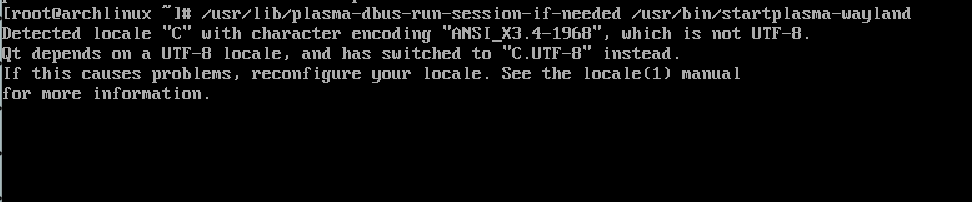

# Documenting my installation of Arch Linux using the official installation guide

Official guide: [https://wiki.archlinux.org/title/Installation_guide](https://wiki.archlinux.org/title/Installation_guide)

## 1. Preparing ISO

- [x] Acquire ISO file
- [x] verify ISO (I used sha256 checksum)
- [ ] make a bootable usb (I will start with a virtual machine)

## 2. Boot computer (virtual machine)

### 2.1. Select keyboard layout

My targets: English, Japanese. `loadkeys us`

Default font is good enough.

### 2.2. Boot mode

`cat /sys/firmware/efi/fw_platform_size` >> no such file >> BIOS mode


### 2.3. Check internet / update system time

My VM is using wired internet. Saved me some setup hassel. Pinging resulted OK.


### 2.4. Partition disk

Command: `lsblk`

I have a lot of Linux distros installed for testing. Arch linux will be install in `sdf`.


In some YouTube video there is a tool that has a graphical user interface displayed in command line form. Donno what tool is that.

launching `fdisk`: `fdisk /dev/sdf`


create partition table (I am using a new vm disk, also instruction is very clear):


format partitions: `mkfs.ext4 /dev/sdf1`, `mkswap /dev/sdf2`

mount disk: `mount /dev/sdf1 /mnt`

One thing I don't get: 
> ["Create any remaining mount points (such as /mnt/boot) and mount the volumes in their corresponding hierarchical order."](https://wiki.archlinux.org/title/Installation_guide#Mount_the_file_systems)

What does it mean? Do I need to create all linux directories (/etc, /boot, and everything else)?

According to [another guide](https://linuxiac.com/arch-linux-install/#6-create-file-system), it seems root partition alone is good. So I'll leave it like that.

Enable swap: `swapon /dev/sdf2`

## 3. Installation

### 3.1 (Optional) select a mirror

Skip, use default no matter how slow it is.

### 3.2 install essential packages

`pacstrap -K /mnt base linux linux-firmware`

Feels like it is initialize a system in `/mnt` directory.


### 3.3 Configuring system

fdtab: `genfstab -U /mnt >> /mnt/etc/fstab`

chroot: `arch-chroot /mnt`

install nano to edit text: `pacman -S nano`

uncommen locales: `nano /etc/locale.gen`

create locale.conf: `nano /etc/locale.conf` and write `LANG=en_US.UTF-8`

install network manager: `pacman -S networkmanager`. Configuring it later (can't run `systemctl`)

**I should have but didn't perform this step:** installed `dhcpcd` and enabled its service (`systemctl enable dhcpcd`).

set root password: `passwd`

#### boot loader

I boot with BIOS so I'll skip the UEFI steps.

`pacman -S grub efibootmgr`

`prub-install --target=i386-pc /dev/sdf`

Probing other systems is done later.

## 4. Reboot

System is bootable, but internet is broken. :<

## 5. Post Installation

### 5.1 fixing no internet

Link: [https://bbs.archlinux.org/viewtopic.php?pid=2028710#p2028710](https://bbs.archlinux.org/viewtopic.php?pid=2028710#p2028710)

> To get wired network, I found I had to:
>
> create the file /etc/systemd/network/20-wired.network
>
>```bash
>[Match]
>Name=en*
>Name=eth*
>
>[Network]
>DHCP=yes
>```
>
> Then either restart or start:
>
>```bash
>sudo systemctl start systemd-networkd  # mine is running, enabled, run "restart"
>sudo systemctl start systemd-resolved  # mine is inactive, disabled, run "start"
>```
>
>It's a lot easier if you remember to install dhcpcd, and sudo systemctl start dhcpcd. I've forgotten on a few test systems.
>
>I found parsing the wiki for the info to get a functional network using systemd somewhat obscured and time consuming? But I'm just a stupid ape that likes Arch! YMMV

After proforming the "magic" Internet will work. I installed `dhcpcd` and enabled its service. The internet is fixed.

### 5.2 install desktop environment

My desktop environment of choise: KDE Plasma

`pacman -S plasma-meta`

for selectable dependencies, I use defualts, which are: `qt6-multimedia-ffmpeg`, `jack2`, `gnu-free-font`, `noto-font-emoji`

Plasma is installed, and I can't use it... Is it not enough menory? This VM has 2 gugabytes of memory tho...


